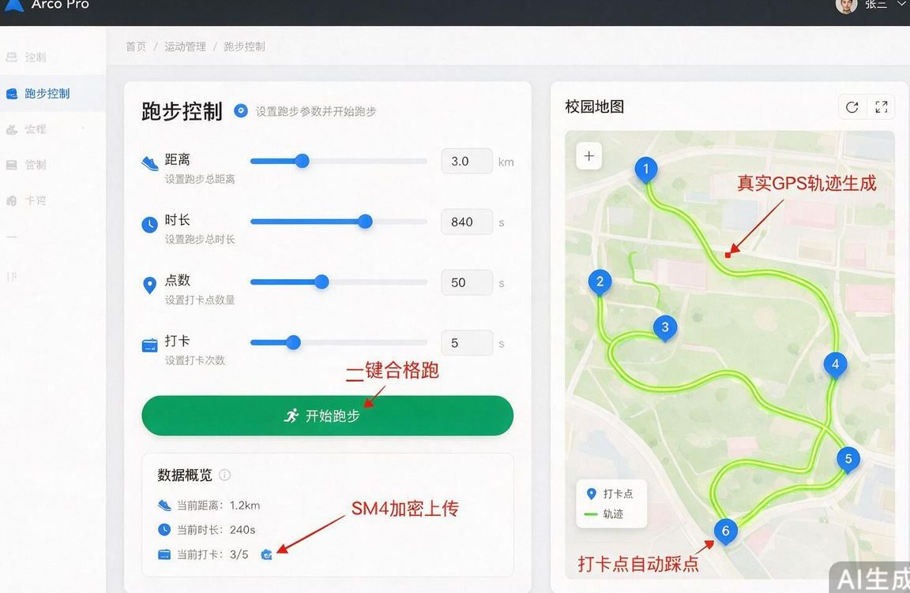
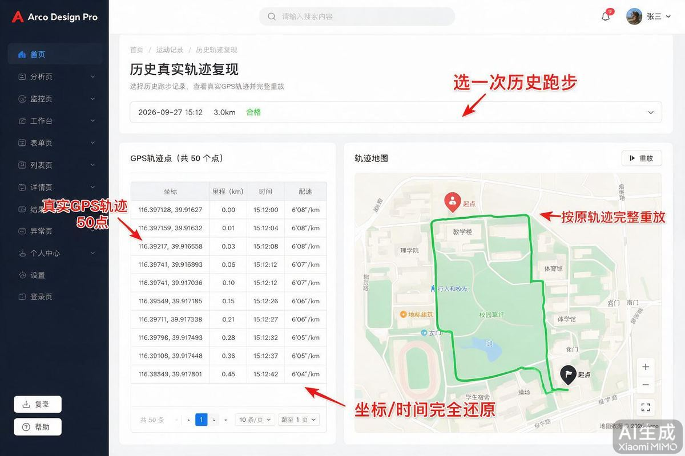
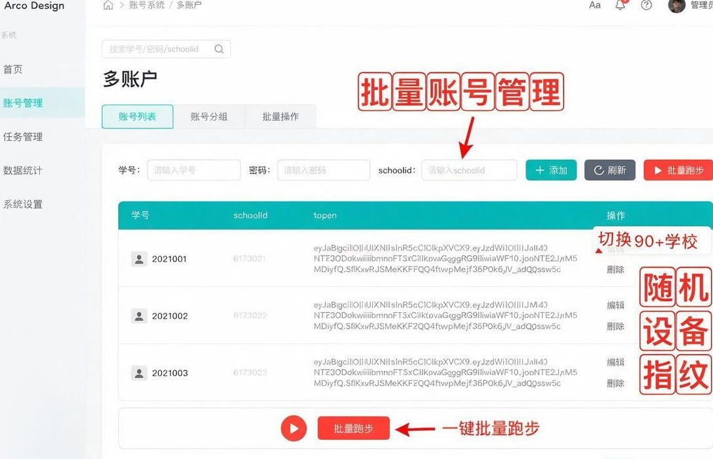
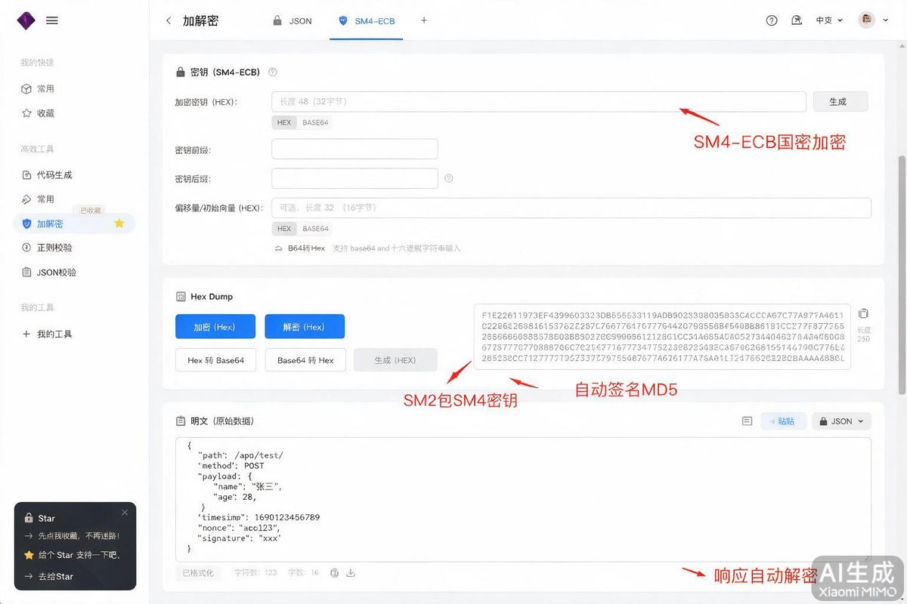
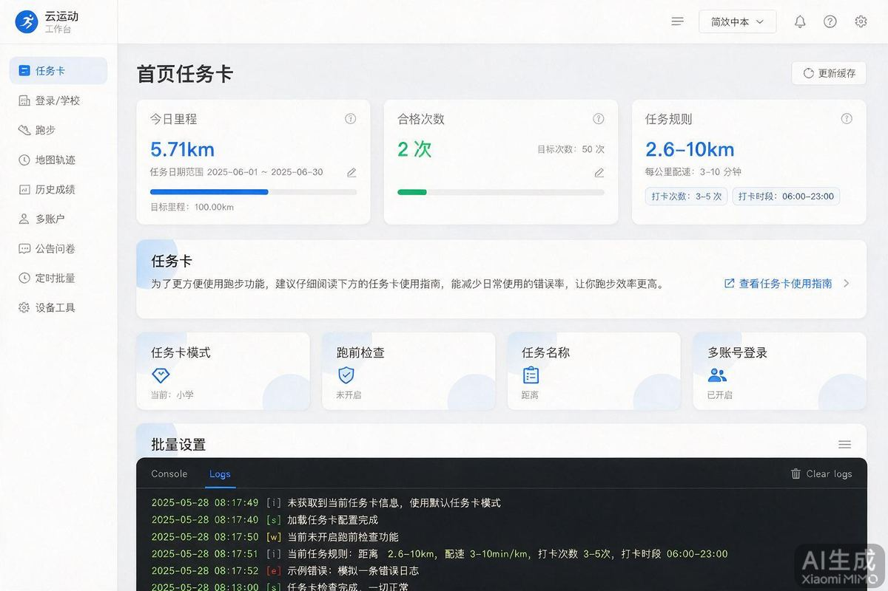
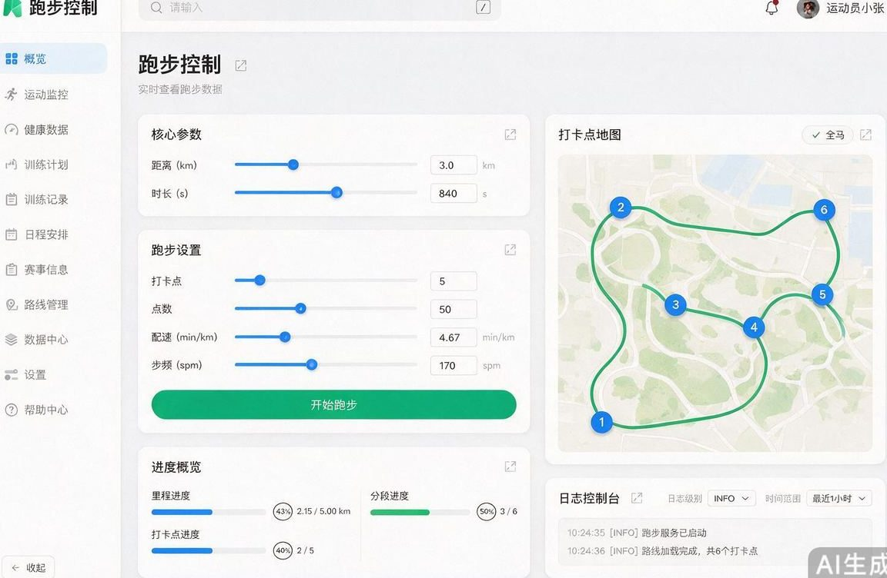
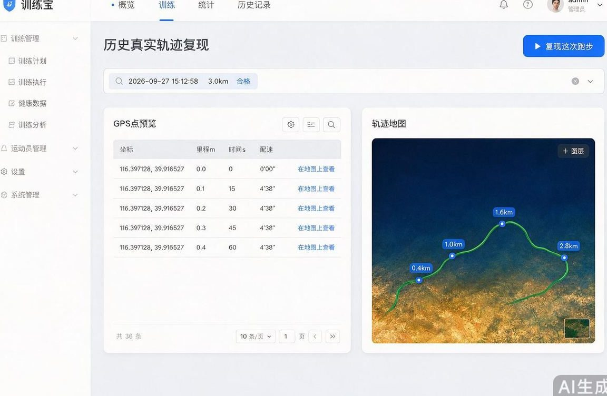
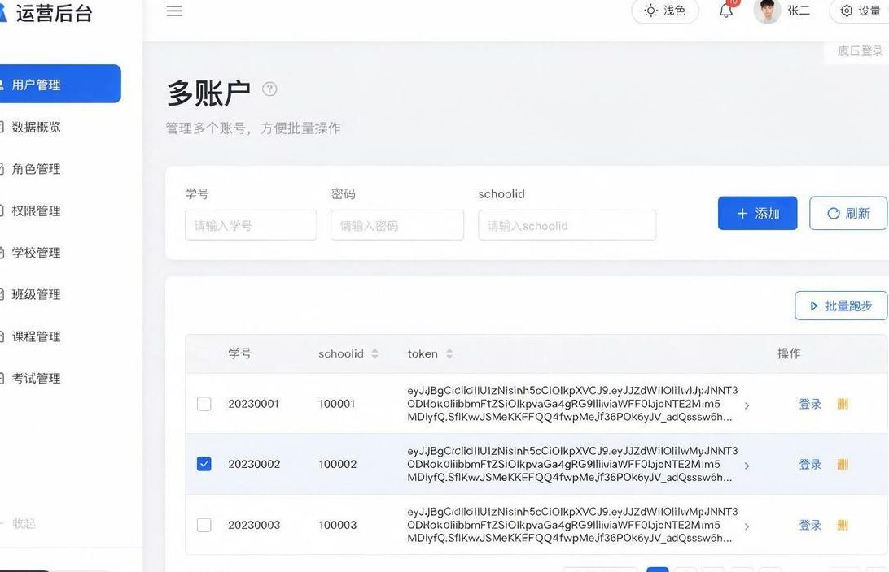

# 云运动 · yunyundong

> **云运动自动跑步 · LePao 3.6.6 协议完整复现 · 一键合格跑**
>
> 关键词：**云运动** / 云运动代跑 / 云运动脚本 / 云运动自动跑步 / LePao / 校园跑步 / 健跑自动化

---

## ✨ 这是什么？

**云运动**（LePao）校园健跑 App 的**协议完整复现 + 自动跑步客户端**。

不是简单的「模拟点击」——我们把 **SM4 国密加密 + SM2 密钥封装 + MD5 签名** 全部打通，直接构造合法请求：

- 🏃 **一键合格跑** — 真实 GPS 轨迹 + 打卡点踩点 + 分段上传
- 🎯 **历史真实轨迹复现** — 选一次真跑，按原轨迹 50 点完整重放
- 👥 **多账户批量** — 批量账号一键跑，12 种设备指纹随机
- 🗺️ **动态真实地图** — 高德瓦片 + 打卡点自动居中
- ⏰ **定时挂机** — 每日定时 / 批量 config / CLI & GUI
- 🔐 **SM4 国密加密** — 协议栈完整复现，可对接各校同类系统

**实测结果**：3.0km / 840s / 50 点 / 踩 5 点 →「恭喜你当前跑步成绩合格」

---

## 🔥 核心功能（红字标注图解）

### 1. 一键跑步 · 真实 GPS 轨迹



> 红字说明：真实 GPS 轨迹生成 · 打卡点自动踩点 · SM4 加密上传 · 一键合格跑

### 2. 历史真实轨迹复现



> 红字说明：选一次历史跑步 · 真实 GPS 轨迹 50 点 · 按原轨迹完整重放 · 坐标/时间完全还原

### 3. 多账户批量 · 学校切换



> 红字说明：批量账号管理 · 一键批量跑步 · 随机设备指纹 · 切换 90+ 学校

### 4. SM4 国密加解密



> 红字说明：SM4-ECB 国密加密 · SM2 包 SM4 密钥 · 自动签名 MD5 · 响应自动解密

---

## 🖥️ 界面预览

| 任务卡 | 跑步 | 历史复现 | 多账户 |
|--------|------|----------|--------|
|  |  |  |  |

---

## 📦 功能清单

- **协议完整复现**：SM4-ECB + SM2 包 SM4（cipherKey / content / sign）
- **一键跑步**：打表 / 快速 / 真实 GPS 轨迹 + 漂移
- **历史轨迹复现**：选一次历史跑步，按原轨迹点完整重放
- **多账户批量**：批量账号管理，一键批量跑
- **任务卡**：里程/时段/配速/晨跑规则/今日进度
- **学校切换**：90+ 学校列表 / 随机切校
- **设备指纹**：12 种机型随机
- **定时挂机**：每日定时 / 批量 config
- **动态地图**：中心自动取打卡点包围盒，换校自动跳转
- **GUI + CLI**：桌面工作台（内置 Web DEV CONSOLE）+ 命令行

---

## 🚀 快速开始

```bash
cp yunyundong_config.example.json yunyundong_config.json
# 填 username / password / school_id
python yunyundong_full.py
```

或直接用 `云运动全功能.exe`（独立运行，无需 Python）。

---

## ⚙️ 配置

```json
{
  "username": "学号",
  "password": "密码",
  "school_id": "169",
  "dist_km": 3.0,
  "duration_s": 840,
  "n_points": 50,
  "marks": 5,
  "route": "loop",
  "timer_on": true,
  "timer_hh": 7,
  "timer_mm": 30
}
```

**注意**：`yunyundong_config.json` 含账号密码，**不要提交到 git**（已在 `.gitignore`）。

---

## 🔐 协议要点

| 项 | 值 |
|----|-----|
| 加密 | content = `Base64(SM4-ECB-PKCS7(json))` |
| 密钥 | cipherKey = SM2(sm4_key)，固定 SM2 密文 |
| split | 先 `gzip(json)` 再 SM4 |
| 响应 | gzip → JSON字符串(b64) → SM4 解密 |
| sign | `MD5(platform & utc & uuid & appsecret)` |
| appsecret | `0h1UIfMDSc7piesRINRXXfkE` |
| version | `3.6.6`（3.5.10 会被拒） |
| 登录 | `{"userName","password","schoolId","type":"1"}` |

---

## 🎯 合格配方

- 里程 2.6–10 km（默认 3.0）
- 配速 3–10 min/km（840s/3km ≈ 4.67）
- 打卡 ≥3（默认 5），`manageList` 坐标对
- 轨迹过打卡点（cardRange 20m）
- 时段 06:00–23:00

实测：3.0km / 840s / 50 点 / 踩 5 点 →「恭喜你当前跑步成绩合格」

---

## 📁 文件说明

| 文件 | 用途 |
|------|------|
| `yunyundong_full.py` | 主程序（Web 工作台 + CLI） |
| `yunyundong_client.py` | 全接口客户端 |
| `sm4_std.py` | 标准 SM4（过国标测试向量） |
| `run_qualified.py` | 合格跑步脚本 |
| `云运动工作站.html` | 网页版工作台 |
| `docs/` | 功能截图（含红字标注） |
| `本地代理.py` | 网页版跨域代理 |

---

## 🔍 关键词

**云运动** · 云运动代跑 · 云运动脚本 · 云运动自动跑步 · 云运动刷跑 · 云运动代跑脚本 · LePao · 校园跑步 · 健跑自动化 · 云运动 3.6.6 · SM4 · SM2 · 国密 · 自动跑步 · GPS 轨迹 · 历史轨迹复现 · 多账户批量

---

## 免责声明

本项目仅供学习交流，禁止用于违规用途。使用者应遵守所在学校/地区法律法规，一切后果自负。

## License

MIT
